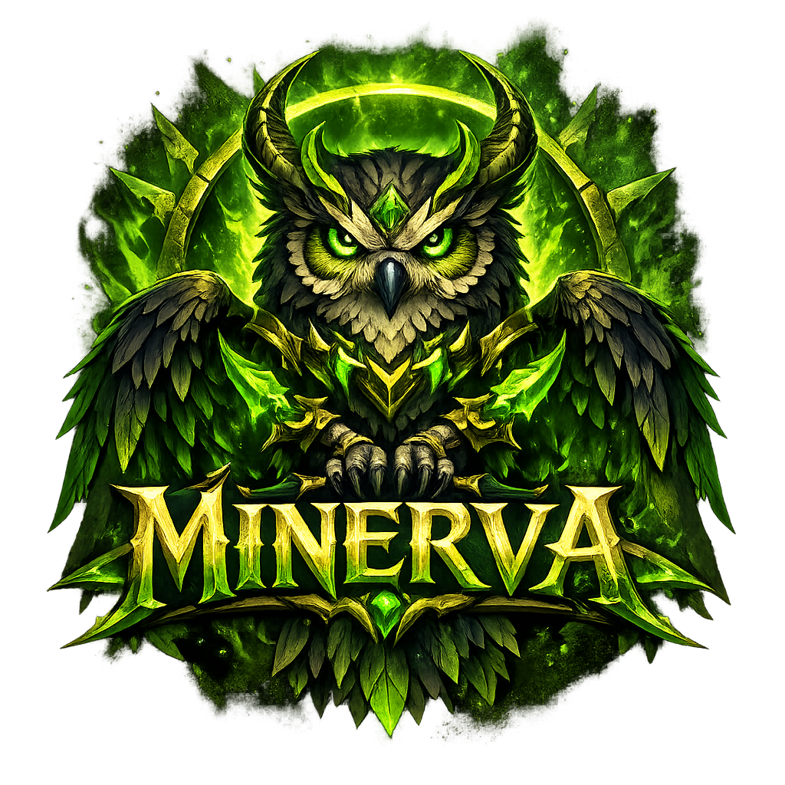

# DestinyCore — Minerva Realm

<p align="center">
  
</p>

<h1 align="center">DestinyCore</h1>

<p align="center">
  <b>World of Warcraft: Legion (7.3.5)</b> server core for the <b>Minerva</b> realm.<br/>
  Built for performance, customization, and a clean developer experience.
</p>

<p align="center">
  <a href="LICENSE"></a>
  <a href="https://github.com/DestinyCore/DestinyCore/stargazers"></a>
  <a href="https://github.com/DestinyCore/DestinyCore/commits"></a>
  <a href="https://github.com/DestinyCore/DestinyCore/issues"></a>
  <a href="https://github.com/DestinyCore/DestinyCore/pulls"></a>
</p>

<p align="center">
  <a href="https://discord.gg/YOUR_INVITE_CODE"></a>
</p>

---

## ⚔️ About

**DestinyCore** is a modern, Legion-focused server core built on the TrinityCore ecosystem.  
It aims to provide a stable, maintainable and extendable foundation for long-term development — whether you're running a serious community realm or building custom systems for fun.

The realm is called **Minerva** — inspired by the goddess of wisdom — and its symbol is the **owl**.

---

## ✨ Key Features

- ⚔️ **Legion (7.3.5)** focused project
- 🧩 **Modular architecture** (authserver / worldserver / shared libs)
- ⚡ **Performance-oriented** and scalable design
- 🛠️ **CMake-based** build system
- 🗃️ **MySQL / MariaDB** ready (auth / characters / world)
- 🧑‍💻 Built for clean customization & long-term maintainability

---

## 🧱 Architecture Overview

DestinyCore is split into major components:

### `authserver`
Handles:
- Account authentication
- Realm list & login services
- Secure session management foundations

### `worldserver`
Runs:
- Game simulation & map handling
- AI, spells, movement, combat
- Script execution and world logic

### Shared / common libraries
Contains:
- Utilities & helpers
- Database layer
- Reusable framework systems

---

## 🧰 Requirements

### Build Tools
- **Git**
- **CMake** (latest stable recommended)
- A modern **C++ compiler**
  - Linux: **GCC** / **Clang**
  - Windows: **MSVC (Visual Studio 2022)**

### Database
- **MySQL** or **MariaDB**

---

## 📥 Getting Started

### 1) Clone the Repository

```bash
git clone https://github.com/DestinyCore/DestinyCore.git
cd DestinyCore
```

---

## 🛠️ Build Instructions

### Linux (recommended)

```bash
mkdir -p build
cd build

cmake -DCMAKE_BUILD_TYPE=Release ..
cmake --build . -j
```

Run:

```bash
./authserver
./worldserver
```

---

### Windows (Visual Studio)

```powershell
mkdir build
cd build
cmake .. -G "Visual Studio 17 2022" -A x64
cmake --build . --config Release
```

Run:

- `authserver.exe`
- `worldserver.exe`

---

## ⚙️ Configuration

Configuration is handled through `.conf` files.

Typical config files:

- `authserver.conf`
- `worldserver.conf`

Make sure you set:

- Database credentials (auth / characters / world)
- Realm name & network settings
- Server ports

---

## 🗃️ Database Setup

DestinyCore uses separate databases:

- **auth**
- **characters**
- **hotfixes**
- **world**

General workflow:

1. Create the databases in MySQL/MariaDB
2. Import the SQL structure/data from the repository
3. Update the `.conf` files with your DB credentials
4. Start `authserver`, then `worldserver`

> Tip: If you can’t find SQL files, look for `sql/` or `data/sql/` folders in the repository.

---

## 🧩 Customization

DestinyCore is made to be extended:

- Custom scripts (NPCs, spells, quests, systems)
- Custom DB content
- New gameplay systems
- Modules and reusable components

Recommended approach:

- Keep features isolated
- Prefer clean systems over quick hacks
- Write maintainable code and document changes

---

## 🧪 Debug Builds

For development and debugging:

```bash
cmake -DCMAKE_BUILD_TYPE=Debug ..
cmake --build . -j
```

Useful debugging tips:

- Watch the console output / logs
- Validate DB connections
- Check config file paths and permissions
- Verify client data requirements (if applicable)

---

## 🤝 Contributing

Contributions are welcome ❤️

### How to contribute
1. Fork the repository
2. Create a branch  
   ```bash
   git checkout -b feature/my-feature
   ```
3. Commit your changes
4. Push your branch
5. Open a Pull Request

### Guidelines
- Keep PRs focused and readable
- Follow existing code conventions
- Avoid formatting-only commits unless necessary
- Write clear commit messages

---

## 🐞 Issues / Support

If you find a bug or want to request a feature:

👉 https://github.com/DestinyCore/DestinyCore/issues

When reporting bugs, please include:
- OS + compiler version
- Build type (Debug/Release)
- Crash logs / stack traces
- Steps to reproduce

---

## ❓ FAQ

### Is this production-ready?
DestinyCore is under active development. It can be used for development and experimentation, but expect changes.

### Does this include client files?
No. You must provide your own client-side files and follow legal requirements.

---

## 📄 License

DestinyCore is licensed under the **GNU GPL v2**.  
See `LICENSE` for details.

---

## ⭐ Support

If you like **DestinyCore / Minerva**, consider giving the repository a ⭐ — it helps a lot!
